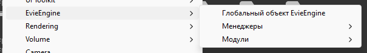

[Назад](../readme.md)
## DebugBoundingBoxDrawer

Позволяет в режиме редактора обвести любой объект квадратом который будет всегда виден, классно например для интеграции с `TriggerZone` (Все что нужно для работы назначить любому объекту тег `Evie_Debug`)

## FastElementCreate

Упрощает вам работу, не нужно искать префабы в директории EvieEngine, просто используйте контекстное меню

## FastReload

Смотрите в основном Readme))

## TriggerManagerEditor

Позволяет смотреть и изменять триггеры во время игры, открывается так: `Evie Engine > Tools > Trigger Manager`