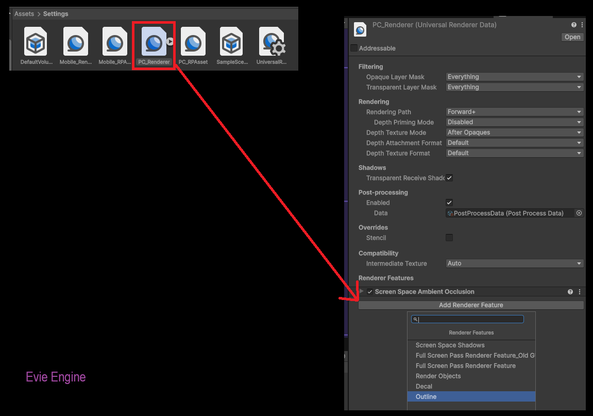

# Evie Engine

Движок для меня любимого. Писать подробную доку не хочу и не буду. Если вам понравится делайте сами. Лицензия MIT делайте че хотите. Проект и движок на русском языке.

Взял все лучшее из EvieCore улучшил и превратил в под движок для Unity. Это реально неебический конвеер для создания игр. FPC и Камера просто отрыв фляги :D

ТОЛЬКО РУССКИЙ ЯЗЫК, ВНУТРИ ВСЕ НА РУССКОМ // RUSSIAN RUSSIAN ONLY, EVERYTHING INSIDE IS IN RUSSIAN

<h6>Пендосы сосать</h6>

# Зависимости проекта

## Tri-Inspector

https://github.com/codewriter-packages/Tri-Inspector

https://github.com/codewriter-packages/Unity-Localization-Stub-for-Tri-Inspector.git

## Unity-URP-Volumetric-Light

https://github.com/CristianQiu/Unity-URP-Volumetric-Light 

https://github.com/CristianQiu/Unity-URP-Volumetric-Light.git

## Toon Muzzleflash Pack

https://assetstore.unity.com/packages/p/toon-muzzleflash-pack-56572

# Настройка

## Настройка постпроцессинга

после этого добавляй эффекты в Global Volume

# Установка

Качаем исходники и адаптируем под себя, либо качаем в релизе готовый проект. Unity 6.0 (6000.0.57f1 LTS)

Поддерживаются только URP проекты. В теории можно запустить и под HDRP.